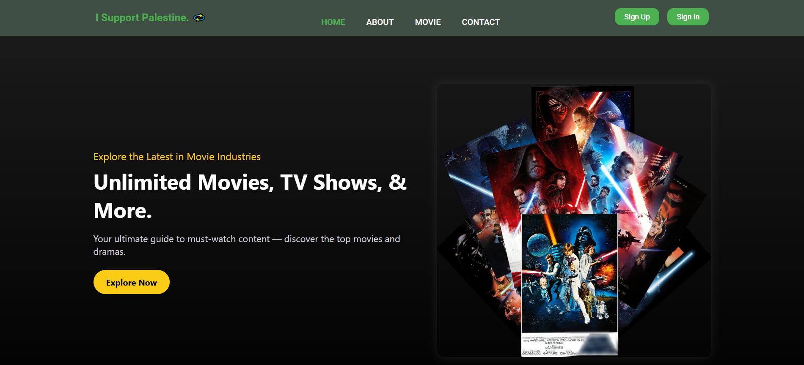
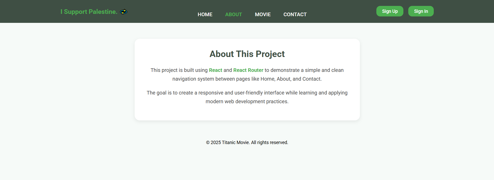
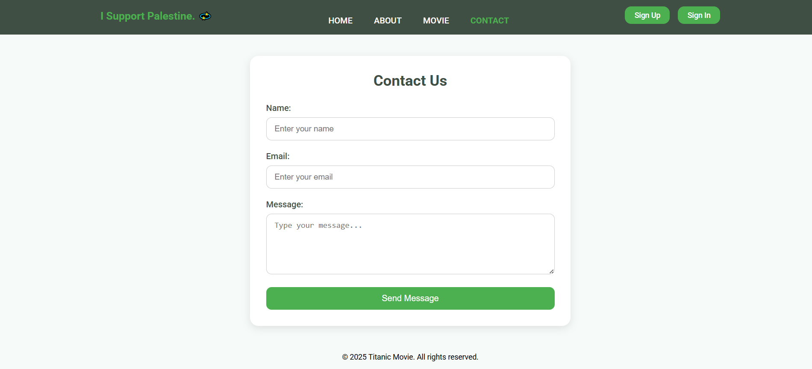
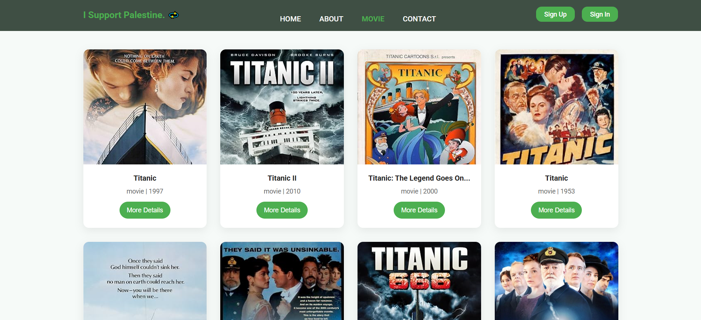

# 🎬 Movie Titanic - React Router App

A React-based movie showcase app using **React Router**. Navigate through beautifully styled pages like Home, About, Contact, and a detailed Movie Page, all with smooth transitions and a user-friendly layout.

🔗 **Live Demo**: [titanic-movie-react-router.netlify.app](https://titanic-movie-react-router.netlify.app/)  
📂 **GitHub Repo**: [github.com/TASHFIQ01791/Movie_Titanic-React-Touter](https://github.com/TASHFIQ01791/Movie_Titanic-React-Touter)

---

## 🌟 Features

- 🏠 **Home Page**: Engaging introduction to the app.
- ℹ️ **About Page**: Brief information about the app/project.
- 📬 **Contact Page**: Placeholder for contact details or form.
- 🎥 **Movie Page**: Detailed display of a featured movie.
- ⏳ **Loader**: Smooth loading animation when switching pages.

---

## 🛠️ Technologies Used

- ⚛️ React
- 🌐 React Router DOM
- 💅 CSS (custom styling)
- 🖼️ Image assets

---

## 📸 Screenshots

### 🔹 Home Page


### 🔹 About Page


### 🔹 Contact Page


### 🔹 Movie Page


### 🔹 Loader Animation


---

## 🚀 Getting Started

### 1. Clone the Repository

```bash
git clone https://github.com/TASHFIQ01791/Movie_Titanic-React-Touter.git
cd Movie_Titanic-React-Touter
